# ⚡ exachat — Architecture

```mermaid
flowchart LR

    %% ─── User Interface ────────────────────────────────────────────────────────
    subgraph UI["🖥️  User Interface"]
        direction TB
        CLI["⚡ CLI\nauto-setup wizard\nMLX server auto-start\nmodel auto-download"]
        subgraph TABS["Streamlit App — 4 tabs"]
            direction TB
            ASK["💬 Ask\nChat · explore starters\nmulti-turn history"]
            BUILD["🔧 Build\nvisual query builder\nno LLM required"]
            MET["📐 Metrics\nKPI catalog browser"]
            SCH["🗺️ Schema\nER relationship map"]
        end
        CLI --> TABS
    end

    %% ─── Core Pipeline ─────────────────────────────────────────────────────────
    subgraph CORE["⚙️  ExasolChat — ask() pipeline"]
        direction TB
        S1["① KB retrieval\nRAG · top-N SQL patterns\nby semantic similarity"]
        S2["② Schema retrieval\nnarrow to relevant tables\nexpand via FK neighbours"]
        S3["③ SQL generation\ndialect hints · KB context\nconversation history · access control"]
        S4["④ Safety validation\nblock DDL / DML / EXEC\nschema + table allowlist"]
        S5["⑤ Execute query\ncap rows · column warnings"]
        ERR{"Error?"}
        S6["⑥ LLM auto-correct\ndiagnose error · fix SQL\nre-validate · re-execute\n≤ 3 attempts total"]
        S7["⑦ Enrich result\nnatural-language summary\nAI chart suggestion\n3 follow-up questions"]
        HIST[/"🕐 Conversation history\nlast 3 successful turns"/]

        S1 --> S3
        S2 --> S3
        HIST -. "context" .-> S3
        S3 --> S4 --> S5 --> ERR
        ERR -- "yes · attempt N/3" --> S6 --> S3
        ERR -- "no" --> S7
    end

    %% ─── Knowledge & Schema ────────────────────────────────────────────────────
    subgraph RAG["📖  Knowledge & Schema Layer"]
        direction TB
        KB["Knowledge Base\n200+ enriched domain patterns\n15 JSON files · eCommerce · Finance\nMarketing · Product · BI\nInflation & deflation causes\nCausal relationships · SQL assets\nAnti-patterns · Metric nature"]
        SI["Schema Index\nper-table semantic embeddings\nactivates for schemas > 15 tables\nFK-aware join expansion"]
    end

    %% ─── LLM Backends ──────────────────────────────────────────────────────────
    subgraph LLM["🧠  LLM Backends"]
        direction TB
        OLL["Ollama\nany local model\nqwen3 · llama3 · etc."]
        MLX["MLX\nApple Silicon · Metal GPU\nserver auto-starts on demand\nmodel auto-downloaded once"]
        OAI["OpenAI-compatible\nLM Studio · vLLM\ntext-gen-webui · LocalAI"]
        TASKS["LLM tasks:\ngenerate_sql · fix_sql\ngenerate_summary\nsuggest_chart · suggest_followups\ngenerate_explore_questions"]
    end

    %% ─── Embedding Backends ────────────────────────────────────────────────────
    subgraph EMB["🔢  Embedding Backends  (shared by KB + Schema Index)"]
        direction LR
        FE["FastEmbed\nnomic-embed-text-v1.5\nin-process ONNX · default\nno server needed"]
        OLE["Ollama\nnomic-embed-text\nvia /api/embeddings"]
        OAE["OpenAI-compatible\nbatched /v1/embeddings"]
        BOW["Bag-of-Words\nMD5-hashed tokens\noffline fallback · zero deps"]
    end

    %% ─── Storage ───────────────────────────────────────────────────────────────
    subgraph ST["💾  Persistence"]
        direction TB
        CDB[("ChromaDB\nKB pattern vectors\nschema index vectors\ncosine similarity")]
        MJS[("Metrics JSON\nKPI definitions\nSQL templates\ndimensions & filters")]
    end

    %% ─── Database Backends ─────────────────────────────────────────────────────
    subgraph DB["🗄️  Database Backends"]
        direction TB
        Duck[("DuckDB\nin-process analytics\nParquet · CSV · JSON")]
        Exa[("Exasol\nin-memory OLAP\npyexasol native driver")]
        PG[("PostgreSQL\npsycopg3")]
        Any[("SQLAlchemy+\nMySQL · SQLite\nSnowflake · BigQuery · …")]
    end

    %% ─── Edges ─────────────────────────────────────────────────────────────────

    ASK -- "natural language\nquestion" --> CORE
    CORE -- "SQL · data · summary\nchart · follow-ups\nauto-correct notice" --> ASK
    BUILD -- "metric + table\nselection" --> MJS

    S1 -- "search()" --> KB
    S2 -- "retrieve()" --> SI

    S3 & S6 & S7 --> LLM

    S5 --> DB

    KB & SI -- "embed_text()" --> EMB
    KB -- "upsert / query" --> CDB
    SI -- "upsert / query" --> CDB
    MJS -. "loaded at\nconnect time" .-> CORE
```

---

## Component Responsibilities

| Component | What it does | Key achievement |
|---|---|---|
| **CLI** | Wraps Streamlit launch | Auto-starts MLX server, downloads model if missing, runs setup wizard on first run |
| **Ask tab** | Chat UI | Shows attempt N/3 status, auto-correct notice, AI summary, follow-up pills, explore starters |
| **Build tab** | Visual query builder | Constructs SQL from point-and-click without LLM — metrics + filters + aggregations |
| **Knowledge Base** | RAG over SQL patterns | 200+ enriched patterns across 5 domains with inflation/deflation causes, causal chains, graduated SQL assets |
| **Schema Index** | Semantic table retrieval | Activates on schemas > 15 tables — prevents prompt overflow while keeping join paths intact |
| **ask() pipeline** | 7-step orchestrator | KB lookup → schema narrowing → generation → safety → execute → auto-correct → enrich |
| **Auto-correct loop** | Self-healing queries | Up to 3 attempts; LLM diagnoses the DB error, rewrites SQL, re-validates safety, retries |
| **Safety Validator** | SQL risk classification | Blocks all DDL/DML/EXEC; enforces schema and table allowlists; classifies SAFE / SUSPICIOUS / BLOCKED |
| **LLM Backends** | Pluggable inference | Ollama · MLX (Apple Silicon, auto-starts) · any OpenAI-compatible API; 6 task types per backend |
| **Embedding Backends** | Shared vector embedding | FastEmbed (default, in-process) · Ollama · OpenAI-compat · Bag-of-Words offline fallback |
| **Conversation History** | Multi-turn context | Last 3 successful turns injected into each SQL generation prompt for follow-up resolution |
| **Metrics Catalog** | Business KPI registry | Persisted JSON definitions with SQL templates, dimensions, filters — surfaced in schema prompt |
| **ChromaDB** | Vector store | Single client shared by KB and Schema Index; cosine similarity; collection rebuilt on embedding model change |
